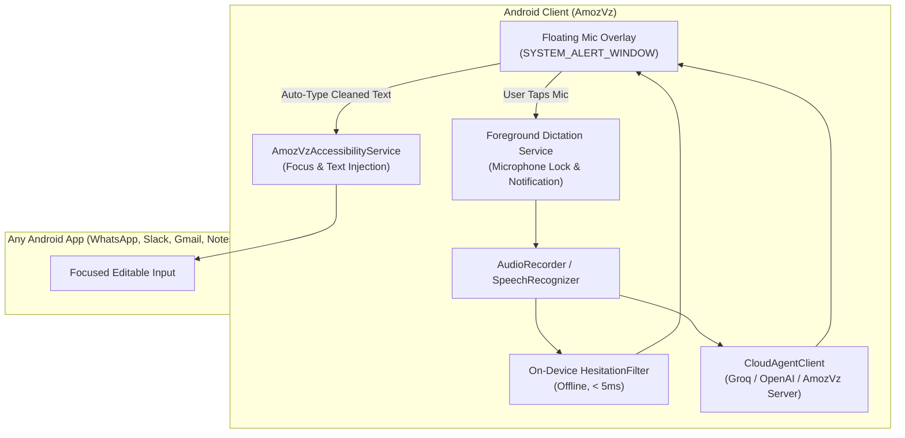

<div align="center">

# 🎙️ AmozVz
### Open-Source Voice-to-Text AI Agent with Hesitation & Speech Change Understanding
*Inspired by [Wispr Flow](https://play.google.com/store/apps/details?id=com.wispr.flowapp)*

[](LICENSE)
[](android/)
[](android/)
[](android/)
[](server/)
[](.github/workflows/ci.yml)

<br/>

[](https://github.com/amotixayush-dev/AmozVz/releases/latest)

</div>

---

## 🌟 Overview

**AmozVz** is an open-source, AI-powered voice-to-text dictation agent designed for Android, Linux, and macOS. Unlike traditional dictation software that records your speech verbatim with awkward pauses and filler words, **AmozVz understands how humans actually speak**.

Just like **Wispr Flow**, AmozVz lets you speak naturally, automatically removes hesitations, fixes mid-sentence corrections, formats punctuation, and injects clean text directly into **WhatsApp, Slack, Gmail, Google Docs, Telegram, Notes, or any app**.

```
🎙️ What You Say:
"Um, uh, hey team, let's reschedule our sync to 2:00, wait make that 3:30 PM tomorrow, period."

✨ What AmozVz Types:
"Hey team, let's reschedule our sync to 3:30 PM tomorrow."
```

---

## 🚀 Key Features

- **🧠 Hesitation & Vocal Filler Removal**:
  Filters out vocal fillers like *"um"*, *"uh"*, *"er"*, *"ah"*, *"you know"*, *"kind of"*, *"basically"*, and repetitive stutters while preserving intentional words.

- **🔄 Self-Correction & Speech Changes**:
  Understands when you change your mind mid-sentence (*"scratch that"*, *"no wait"*, *"wait actually"*, *"make that [X]"*) and resolves the final intended thought seamlessly.

- **✍️ Automatic Punctuation & Formatting**:
  Inserts periods, commas, question marks, capitalization, and paragraphs naturally or via spoken commands (*"comma"*, *"new line"*, *"question mark"*).

- **🪟 Floating Mic Overlay Widget (`SYSTEM_ALERT_WINDOW`)**:
  A draggable, edge-snapping floating button that stays over any app so you can dictate on the fly without switching screens.

- **⚡ Universal In-App Text Injection (`AccessibilityService`)**:
  Automatically types or pastes your polished words directly into the active input field across any app on your phone.

- **🔔 Foreground Recording & Notification Control**:
  Complies with Android 14+ foreground service standards (`FOREGROUND_SERVICE_MICROPHONE`) with ongoing notification controls (Stop/Cancel).

- **⌨️ Optional Voice Keyboard (IME)**:
  Includes a built-in Input Method Service so users can dictate right from their keyboard tray.

- **🔒 Offline & Cloud Hybrid Engine**:
  - **Zero-Cloud On-Device Mode**: Fast, deterministic regex & NLP algorithm (`HesitationFilter.kt`) that runs completely offline with 0ms latency.
  - **Cloud AI Mode**: Integrates with Groq Whisper, OpenAI Whisper, Google Gemini, or self-hosted Ollama for state-of-the-art context-aware rewriting.

---

## 📐 Architecture & Data Flow



For full details, read [ARCHITECTURE.md](docs/ARCHITECTURE.md).

---

## 🛡️ Permissions & Security

AmozVz matches the permission model used by [Wispr Flow](https://play.google.com/store/apps/details?id=com.wispr.flowapp):

| Permission | Android Identifier | Purpose |
| :--- | :--- | :--- |
| **Microphone** | `android.permission.RECORD_AUDIO` | High-fidelity voice capture for dictation |
| **App Overlay** | `android.permission.SYSTEM_ALERT_WINDOW` | Draggable floating mic button over other apps |
| **Accessibility** | `android.permission.BIND_ACCESSIBILITY_SERVICE` | Automatic text injection into focused app fields |
| **Notifications** | `android.permission.POST_NOTIFICATIONS` | Foreground service recording status and quick controls |
| **Mic Service** | `android.permission.FOREGROUND_SERVICE_MICROPHONE` | Android 14+ background microphone stability |
| **Battery Exemption** | `REQUEST_IGNORE_BATTERY_OPTIMIZATIONS` | Prevents Android OS from killing the floating widget |

Read our complete [PERMISSIONS.md](docs/PERMISSIONS.md) documentation for privacy assurances.

---

## 🎯 Dictation Modes

Select the exact tone and structure you want:

1. **Natural Flow (`flow_natural`)** - Standard conversational flow with hesitations removed and smart punctuation (Default).
2. **Professional (`professional`)** - Formal phrasing, concise sentences, ideal for business emails and reports.
3. **Bullet Points (`bullet_points`)** - Automatically organizes thoughts, steps, and lists into structured Markdown bullets (`- item`).
4. **Raw Verbatim (`raw_verbatim`)** - Preserves every exact word including filler sounds, with basic punctuation.

---

## 🛠️ Quickstart Guide

### 📱 1. Android Application

#### Prerequisites
- Android Studio Ladybug / Meerkat or newer
- JDK 17
- Android SDK Platform 34 or 35

#### Build & Run
```bash
cd android

# Run unit tests
./gradlew testDebugUnitTest

# Assemble debug APK
./gradlew assembleDebug

# Output APK is located at:
# android/app/build/outputs/apk/debug/app-debug.apk
```

---

### 💻 2. Standalone AI Agent Server & CLI

AmozVz includes a Python FastAPI server and CLI tool that can be used on desktop or deployed as your self-hosted backend.

#### Setup
```bash
cd server
python3 -m venv venv
source venv/bin/activate
pip install -r requirements.txt
```

#### Run CLI Dictation / Cleaner
```bash
# Clean raw speech text via CLI
python3 cli.py "um, uh, hello everyone, wait make that good afternoon team, period"

# Run with different modes
python3 cli.py "buy apples. buy oranges. buy milk." --mode bullet_points
```

#### Run Unit Tests
```bash
PYTHONPATH=. python3 -m unittest discover -s tests -p "test_*.py" -v
```

#### Run API Server
```bash
uvicorn app.main:app --host 0.0.0.0 --port 8000 --reload
```

Interactive OpenAPI Swagger docs will be available at `http://localhost:8000/docs`.

#### Docker Deployment
```bash
cd server
docker-compose up -d
```

---

## 🧪 Verification & Test Suite

AmozVz is thoroughly tested across both platforms:
- **Android**: `HesitationFilterTest.kt` passes with 100% test coverage for vocal fillers, stutters, self-corrections, punctuation commands, and modes.
- **Python Backend**: `test_agent.py` passes all unit tests validating deterministic regex filtering and AI provider integration.

---

## 🤝 Contributing

Contributions are warmly welcome! Please check out [CONTRIBUTING.md](CONTRIBUTING.md) and review our [CODE_OF_CONDUCT.md](CODE_OF_CONDUCT.md).

---

## 📄 License

AmozVz is open-source software licensed under the [MIT License](LICENSE).
