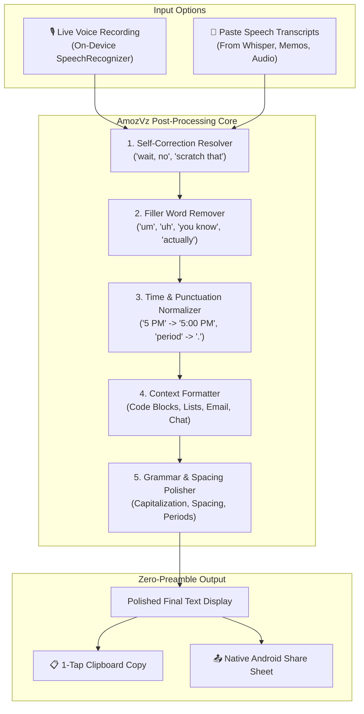

<div align="center">

# 🎙️ AmozVz
### Open-Source Advanced Voice-to-Text Post-Processor
*Inspired by [Wispr Flow](https://play.google.com/store/apps/details?id=com.wispr.flowapp)*

[](LICENSE)
[](android/)
[](android/)
[](android/)
[](server/)
[](.github/workflows/ci.yml)

<br/>

[](https://github.com/amotixayush-dev/AmozVz/releases/download/v1.0.2/AmozVz-v1.0.2.apk)

</div>

---

## 🌟 Overview

**AmozVz** is an advanced open-source voice-to-text post-processor and AI dictation agent designed for Android and Python. Unlike traditional speech-to-text tools that transcribe your voice verbatim with awkward pauses, filler sounds, and false starts, **AmozVz converts messy spoken-word transcriptions into clean, beautifully formatted written text while strictly preserving your original intent and meaning**.

```
🎙️ Raw Spoken Dictation:
"Um, uh, hey team, let's meet at 4, wait, no, 5 PM to review the release, period."

✨ AmozVz Finalized Output:
"Hey team, let's meet at 5:00 PM to review the release."
```

---

## ⚡ The 6 Strict Post-Processing Rules

AmozVz strictly follows six rules on-device and in the backend engine:

1. **Remove All Filler Words**: Eliminates `"um"`, `"uh"`, `"like"`, `"you know"`, `"actually"`, `"I mean"`, `"basically"`, and repetitive stutters.
2. **Resolve Self-Corrections Seamlessly**: Naturally detects when you change your mind mid-sentence:
   - *"Let's meet at 4, wait, no, 5 PM"* ➔ **"Let's meet at 5:00 PM."**
   - *"Send the report to Alice, scratch that, send it to Bob"* ➔ **"Send it to Bob."**
3. **Natural Grammar, Capitalization, and Punctuation**: Sentence casing, comma normalization, period termination, and spoken punctuation symbols (`period`, `comma`, `new line`).
4. **Auto-Structure Output**: Automatically detects step-by-step instructions or lists and formats them as clean bullet points or numbered lists (`1. Step one`, `2. Step two`).
5. **Adapt Formatting to Context**:
   - `💻 Code`: Formats blocks with markdown triple backticks.
   - `✉️ Email`: Formats salutations and professional sign-offs.
   - `💬 Chat`: Concise, conversational style.
   - `📝 Lists`: Formats multi-step thoughts into bullet points.
   - `✨ Auto`: Detects the best formatting context automatically.
6. **No Preamble or Commentary**: Returns **ONLY** the finalized text. Zero conversational filler or introductory remarks like *"Here is your cleaned text:"*.

---

## 📱 Android App Features

- **🎛️ Dual-Input Mode**:
  - **🎙️ Voice Dictate**: Tap the mic to record with real-time waveform visualization and on-device speech recognition.
  - **📝 Paste Speech**: Paste raw transcriptions from any voice memo, Whisper output, or meeting recorder and post-process instantly.
- **🛡️ Zero Sensitive Data Access (Clean Install Guarantee)**:
  - **NO** `BIND_ACCESSIBILITY_SERVICE` (no screen reading or keystroke tracking).
  - **NO** `SYSTEM_ALERT_WINDOW` (no draw-over-apps).
  - **NO** `REQUEST_IGNORE_BATTERY_OPTIMIZATIONS`.
  - Installs cleanly across all Android devices without security warnings or Play Protect blocks.
- **🔏 V2 Scheme Signed**:
  - Pre-signed with Android APK Signature Scheme v2.
- **📋 1-Tap Copy & Native Share**:
  - Instant auto-copy to clipboard.
  - Quick share to WhatsApp, Slack, Gmail, Telegram, Notion, Notes, and more.

---

## 📐 Architecture & Data Flow



---

## 🛡️ Permissions & Privacy

AmozVz respects user privacy and uses the minimum standard permissions:

| Permission | Android Identifier | Purpose | Sensitive? |
| :--- | :--- | :--- | :---: |
| **Microphone** | `android.permission.RECORD_AUDIO` | High-fidelity voice capture for dictation | 🟢 Standard |
| **Notifications** | `android.permission.POST_NOTIFICATIONS` | Foreground service recording status controls | 🟢 Standard |
| **Mic Service** | `android.permission.FOREGROUND_SERVICE_MICROPHONE` | Android 14+ recording stability | 🟢 Standard |
| **Internet** | `android.permission.INTERNET` | Optional cloud API processing | 🟢 Standard |

**Zero high-risk permissions requested:** No Accessibility Service, no Overlay window, no background battery exemptions.

---

## 🛠️ Quickstart Guide

### 📱 1. Android Application

#### Download Ready-to-Install APK
Download the signed APK directly: **[`AmozVz-v1.0.2.apk`](https://github.com/amotixayush-dev/AmozVz/releases/download/v1.0.2/AmozVz-v1.0.2.apk)** (11 MB).

#### Build From Source
```bash
cd android

# Run unit test suite
gradle testDebugUnitTest

# Build signed release APK
gradle assembleRelease
```

---

### 💻 2. Python Backend & CLI

#### Setup
```bash
cd server
python3 -m venv venv
source venv/bin/activate
pip install -r requirements.txt
```

#### Run CLI Dictation Cleaner
```bash
# Clean raw speech text via CLI
python3 cli.py "Let's meet at 4, wait, no, 5 PM"

# Run with context mode
python3 cli.py "first buy milk. second buy eggs. third buy bread." --mode lists
```

#### Run Unit Tests
```bash
PYTHONPATH=. python3 -m unittest discover -s tests -p "test_*.py" -v
```

#### Run FastAPI Server
```bash
uvicorn app.main:app --host 0.0.0.0 --port 8000 --reload
```

---

## 🧪 Verification & Test Suite

AmozVz includes comprehensive unit tests verifying all 6 rules:
- **Android (`HesitationFilterTest.kt`)**: 7/7 unit tests passing on JVM.
- **Python Server (`test_agent.py`)**: 7/7 unit tests passing with zero errors.

---

## 📄 License

AmozVz is open-source software licensed under the [MIT License](LICENSE).
