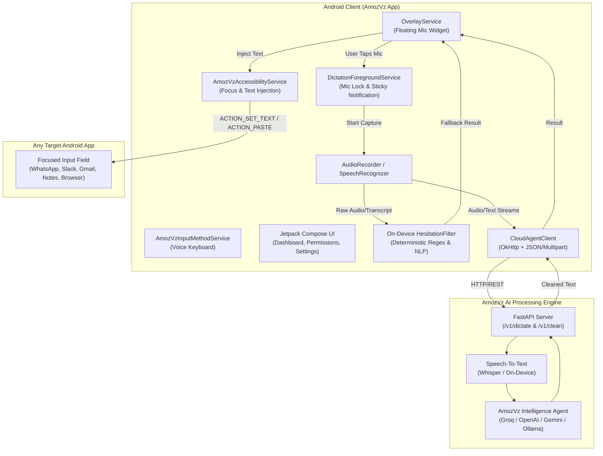

# AmozVz Architecture & Technical Design

**AmozVz** is a voice-to-text AI agent system that transforms natural, messy speech into polished, punctuated, and ready-to-use written text across Android, macOS, and Linux. Modeled after the capabilities of **Wispr Flow**, AmozVz understands vocal hesitations, resolves mid-sentence changes of mind, and automatically formats punctuations and paragraphs.

---

## 1. High-Level System Architecture

---

## 2. Speech Intelligence Pipeline

When speaking naturally, humans pause, hesitate, use filler sounds, and change their thoughts mid-sentence:
> *"Um, uh, hello everyone, we should schedule the product sync for, wait make that 3:30 PM tomorrow, period."*

AmozVz processes this through a multi-stage speech understanding pipeline:

```mermaid
flowchart LR
    A["Raw Audio Stream"] --> B["Acoustic Recognition\n(Whisper / SpeechRecognizer)"]
    B --> C["Raw Spoken Text\n('um, uh, meet at 2 wait make that 3:30')"]
    C --> D["Speech Change Resolver\n(Resolves 'scratch that', 'no wait', 'make that')"]
    D --> E["Spoken Punctuation Parser\n('period' -> '.', 'comma' -> ',')"]
    E --> F["Vocal Hesitation Stripper\n(Filters 'um', 'uh', 'you know', 'basically')"]
    F --> G["Stutter & Syllable De-duplication\n('th-the', 'we we')"]
    G --> H["Custom Vocabulary & Dictionary\n(User keywords & jargon)"]
    H --> I["Casing & Boundary Normalizer\n(Capitalization & sentence structure)"]
    I --> J["Final Injected Text\n('Meet at 3:30 PM tomorrow.')"]
```

---

## 3. Android Component Breakdown

### 1. `OverlayService` (Floating Mic Widget)
- **Window Type**: `WindowManager.LayoutParams.TYPE_APPLICATION_OVERLAY`.
- **Interactions**:
  - Touch listener calculating delta movement: drags smoothly across the screen, snaps to left/right screen edges on release.
  - Distinguishes click from drag gesture (< 10px delta).
  - Tap: Starts active recording, triggers brief haptic pulse, animates mic indicator to recording red, invokes `DictationForegroundService`.
  - Tap again: Stops recording, changes pill state to "Polishing with AI...", executes `AmozVzEngine`.
  - On complete: Injects directly into active input via `AmozVzAccessibilityService`. If no active field was in focus, copies text to clipboard and displays confirmation toast.

### 2. `AmozVzAccessibilityService` (Universal Text Injection)
- **Role**: Allows typing into virtually any app on Android without needing clipboard switching.
- **Events**: Listens to `TYPE_VIEW_FOCUSED`, `TYPE_VIEW_TEXT_CHANGED`, and `TYPE_WINDOW_CONTENT_CHANGED`.
- **Text Insertion**:
  - Direct Insertion: `AccessibilityNodeInfo.ACTION_SET_TEXT` with `ACTION_ARGUMENT_SET_TEXT_CHARSEQUENCE`.
  - Fallback Insertion: Pre-fills clipboard and triggers `AccessibilityNodeInfo.ACTION_PASTE`.

### 3. `DictationForegroundService` (Audio Lifecycle & Sticky Notification)
- **Role**: Maintains ongoing foreground status with Android 14+ `FOREGROUND_SERVICE_TYPE_MICROPHONE`.
- **Notification**: Displays active recording status in the notification shade with quick "Stop" and "Cancel" action buttons.

### 4. `HesitationFilter` (Zero-Latency On-Device Cleaning)
- Deterministic regex and state-machine pipeline.
- Instant (< 5ms) processing time.
- Operates 100% offline with zero network latency and complete privacy.

---

## 4. Dictation Modes

| Mode | Target Use Case | Transformation Behavior |
| :--- | :--- | :--- |
| **Natural Flow (`flow_natural`)** | Messaging, WhatsApp, Slack, Notes | Removes fillers, fixes self-corrections, natural conversational punctuation. |
| **Professional (`professional`)** | Business emails, executive summaries | Crisp phrasing, polished tone, formal sentence structure. |
| **Bullet Points (`bullet_points`)** | Brainstorming, grocery lists, action items | Automatically formats ideas into structured `- item` Markdown lists. |
| **Raw Verbatim (`raw_verbatim`)** | Legal notes, verbatim transcripts | Preserves exact spoken words including fillers with basic punctuation. |
